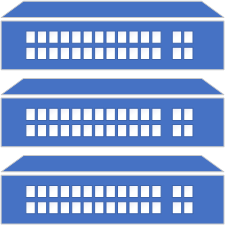

# ioBroker.snmp-interface-control

**Tests:** 

## SNMP Interface Control Adapter für ioBroker

Dieser Adaptere für ioBroker ermöglicht es Netzwerk Switche via SNMP auszulesen und zu steuern.
Vorraussetzung ist das die Geräte SNMP v2c unterstützen.

## Beschreibung

### System

| Name                	| Beschreibung             											|
|:------------------    |:-------------------      											|
| sysDescr	     		| System Beschreibung        										|
| sysUpTime				| Uptime vom System (hundertstel Sekunden seit Neustart)       		|
| sysContact       		| SNMP Contact        												|
| sysName				| SNMP Name        													|
| sysLocation			| SNMP Location        												|

### Interfaces

Die Interfaces können Hardware, Systeminterne oder VLAN Interfaces sein.

| Name                	| Beschreibung             											|
|:------------------    |:-------------------      											|
| ifIndex      			| Index vom Interface  												|
| ifDescr				| Beschreibung vom Interface       									|
| ifType       			| Interface Typ       												|
| ifMtu					| Maximale Paket größe       										|
| ifSpeed				| Interface Geschwindigkeit											|
| ifPhysAddress      	| Physikalische Adresse vom Interface (noch nicht implementiert)   	|
| ifAdminStatus			| Interface Admin Status up (1) down (2) testing (3)       			|
| ifOperStatus       	| Interface Betriebs Status up (1) down (2) testing (3) unknown (4) dormant (5) notPresent (6) lowerLayerDown (7)	|
| ifLastChange			| Uptime vom Interface       										|
| ifInOctets			| Eingegangene Octets         										|
| ifInUcastPkts      	| Eingegangene Unicast Pakete      									|
| ifInNUcastPkts		| Eingegangene Unknown Unicast Pakete (veraltet)						|
| ifInDiscards       	| Eingegangene verworfene Pakete          							|
| ifInErrors			| Eingegangene fehlerhafte Pakete        							|
| ifInUnknownProtos		| Eingegangene verworfene Pakete (nicht unterstütztes Protokoll)	|
| ifOutOctets      		| Ausgegangene Octets        										|
| ifOutUcastPkts		| Ausgegangene Unicast Pakete  										|
| ifOutNUcastPkts       | Ausgegangene Unknown Unicast Pakete (veraltet)						|
| ifOutDiscards			| Ausgegangene verworfene Pakete          							|        													
| ifOutErrors			| Ausgegangene fehlerhafte Pakete        							|
| ifOutQLen				| Ausgehende Pakete in Warteschlage	(veraltet)						|
| ifSpecific			| Verweis auf spezifische SNMP MIBs									|

### System

| Name                	| Beschreibung             											|
|:------------------    |:-------------------      											|
| poePowerClassifications	     		| PoE Klasse class0 (1) class1 (2) class2 (3) class3 (4) class4 (5) |
| poeAdminEnable				| Admin Status true (1) false (2)       		|
| poeDetectionStatus       		| PoE Status disabled (1) searching (2) deliveringPower (3) fault (4) test (5) otherFault (6)  |

## Changelog

### 0.0.1
* (Erdnuss3003) initial release

## License
MIT License

Copyright (c) 2022 Erdnuss3003 <christophweber2@gmx.de>

Permission is hereby granted, free of charge, to any person obtaining a copy
of this software and associated documentation files (the "Software"), to deal
in the Software without restriction, including without limitation the rights
to use, copy, modify, merge, publish, distribute, sublicense, and/or sell
copies of the Software, and to permit persons to whom the Software is
furnished to do so, subject to the following conditions:

The above copyright notice and this permission notice shall be included in all
copies or substantial portions of the Software.

THE SOFTWARE IS PROVIDED "AS IS", WITHOUT WARRANTY OF ANY KIND, EXPRESS OR
IMPLIED, INCLUDING BUT NOT LIMITED TO THE WARRANTIES OF MERCHANTABILITY,
FITNESS FOR A PARTICULAR PURPOSE AND NONINFRINGEMENT. IN NO EVENT SHALL THE
AUTHORS OR COPYRIGHT HOLDERS BE LIABLE FOR ANY CLAIM, DAMAGES OR OTHER
LIABILITY, WHETHER IN AN ACTION OF CONTRACT, TORT OR OTHERWISE, ARISING FROM,
OUT OF OR IN CONNECTION WITH THE SOFTWARE OR THE USE OR OTHER DEALINGS IN THE
SOFTWARE.
